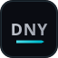
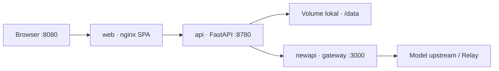

<div align="center">



# DNY-AIGC

**Mesin video AIGC mandiri** — dari naskah sampai potongan akhir, dalam satu alur kerja.

[Mulai cepat](#mulai-cepat) · [Arsitektur](#arsitektur) · [Dokumentasi](#dokumentasi) · [Kontribusi](#status--kontribusi)

<br />


</div>

---

## Apa itu DNY-AIGC?

DNY-AIGC adalah sistem produksi konten video berbasis AI yang berjalan di mesin Anda sendiri. Dirancang sebagai **workbench kreatif**: padat informasi, gelap-prioritas, dan berbahasa Indonesia sebagai pengalaman default.

Alur inti:

| Tahap | Hasil |
| --- | --- |
| Naskah / ingest | Teks terstruktur siap produksi |
| Storyboard & beat | Rencana shot dan konteks visual |
| Aset | Karakter, adegan, properti, gaya |
| Generate | Gambar, sketsa, video per beat |
| Compose | Potongan / keluaran akhir |

Tanpa PostgreSQL atau Redis untuk edisi Community: satu host, tiga layanan Docker, siap dikonfigurasi lewat UI.

---

## Sorotan produk

- **Workbench Freezone** — kanvas node untuk konteks tembakan, latar, sketsa, dan skill produksi
- **Konfigurasi model di UI** — Official / Custom / Hybrid; rahasia tidak diekspos ke browser
- **Gateway bawaan** — NewAPI lokal idle sampai Anda beralih ke mode Custom atau Hybrid
- **UI Indonesia-first** — salinan, label, dan alur utama memakai Bahasa Indonesia
- **Desain sistem DNY** — aksen cyan `#00bdcf`, tipografi Geist, token di `app/DESIGN.md`

---

## Arsitektur



| Layanan | Port | Peran |
| --- | ---: | --- |
| `web` | 8080 | SPA + reverse proxy `/api` |
| `api` | 8780 | Backend kreasi & tugas |
| `newapi` | 3000 | Gateway OpenAI-compatible (bawaan) |

Kode aplikasi utama: [`app/`](app/). Gateway sibling opsional: folder `gateway/` di samping repo (lihat compose).

---

## Mulai cepat

**Prasyarat:** Docker Desktop / Engine dengan plugin Compose.

```bash
# 1. Clone
git clone https://github.com/mydenflix/DNY-AIGC.git
cd DNY-AIGC/app

# 2. (Opsional) gateway untuk build dari sumber
#    taruh checkout di ../gateway
#    atau set DNY_AIGC_GATEWAY_SRC di .env

# 3. Konfigurasi
cp .env.example .env
#    Ubah PROMPT_EXPORT_PASSWORD minimal; key model lewat UI.

# 4. Jalankan
docker compose up -d --build

# 5. Cek
docker compose ps
```

Buka **http://localhost:8080** → Pengaturan → Konfigurasi Model.

Panduan lengkap: [docs/id/getting-started/quickstart.md](app/docs/id/getting-started/quickstart.md)

---

## Struktur repositori

```text
DNY-AIGC/
├── README.md                 ← Anda di sini
├── .agents/                  ← skill agen (Hallmark, dll.)
└── app/                      ← aplikasi CE
    ├── docker-compose.yml    ← build lokal (dny-aigc-local/*)
    ├── frontend/             ← React + Vite (UI)
    ├── src/novelvideo/       ← FastAPI & pipeline
    ├── docs/id/              ← dokumentasi Bahasa Indonesia
    ├── DESIGN.md             ← token visual
    └── tests/
```

---

## Dokumentasi

| Topik | Tautan |
| --- | --- |
| Mulai cepat | [quickstart.md](app/docs/id/getting-started/quickstart.md) |
| Instalasi | [installation.md](app/docs/id/getting-started/installation.md) |
| Konfigurasi model | [configuring-models.md](app/docs/id/getting-started/configuring-models.md) |
| Setup PC lokal | [setup-pc-lokal.md](app/docs/id/getting-started/setup-pc-lokal.md) |
| Pedoman agen | [AGENTS_id.md](app/AGENTS_id.md) |
| Desain visual | [DESIGN.md](app/DESIGN.md) |

---

## Stack

- **Backend:** Python 3.11 · FastAPI · pipeline tugas lokal
- **Frontend:** React · Vite · Tailwind / shadcn · React Flow
- **Ops:** Docker Compose · volume lokal CE
- **Lisensi aplikasi:** Elastic-2.0 (lihat `app/LICENSES/`)

---

## Status & kontribusi

Repositori ini adalah **proyek mandiri DNY-AIGC**.

Kontribusi eksternal: buka issue atau PR dengan deskripsi perubahan, perintah verifikasi, dan dampak konfigurasi/model jika ada.

---

<div align="center">

**DNY-AIGC** · produksi video AIGC, di mesin Anda.

</div>
