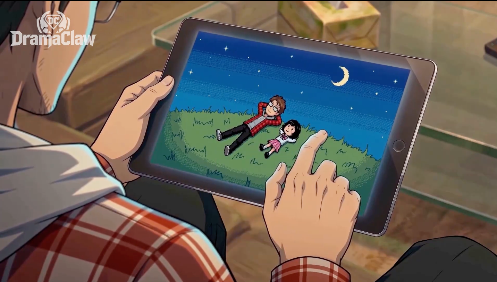
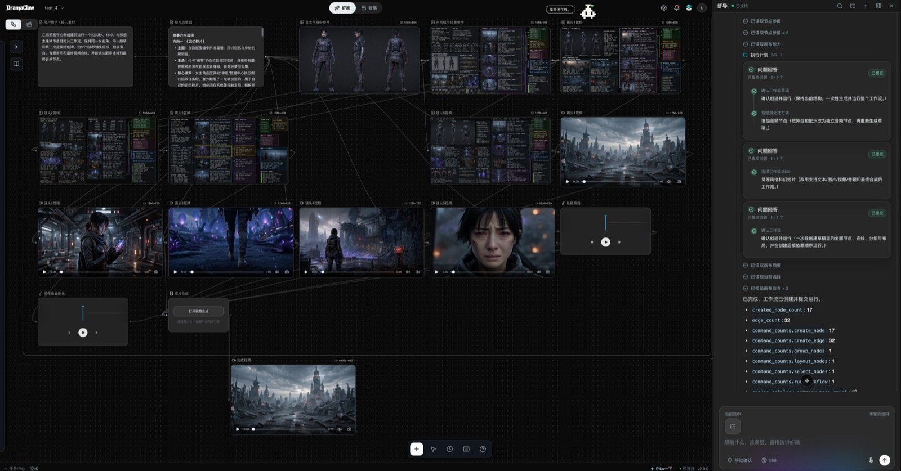
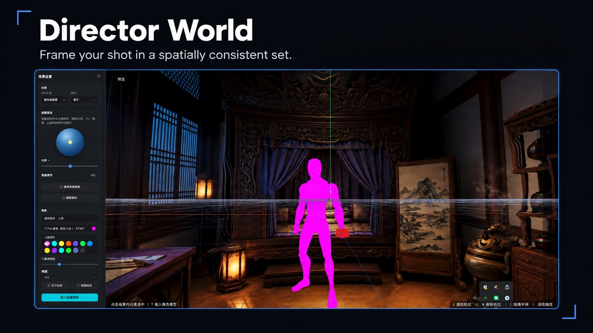
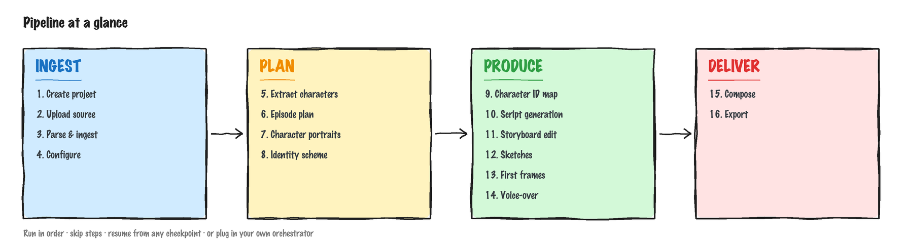
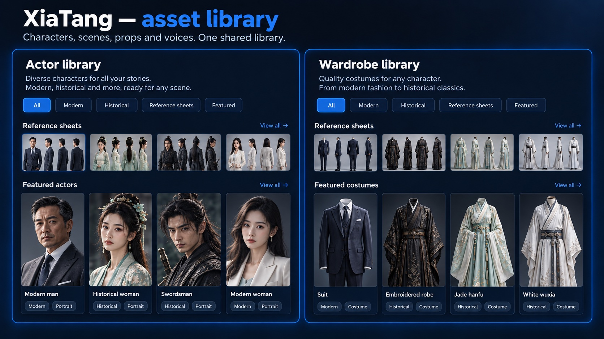
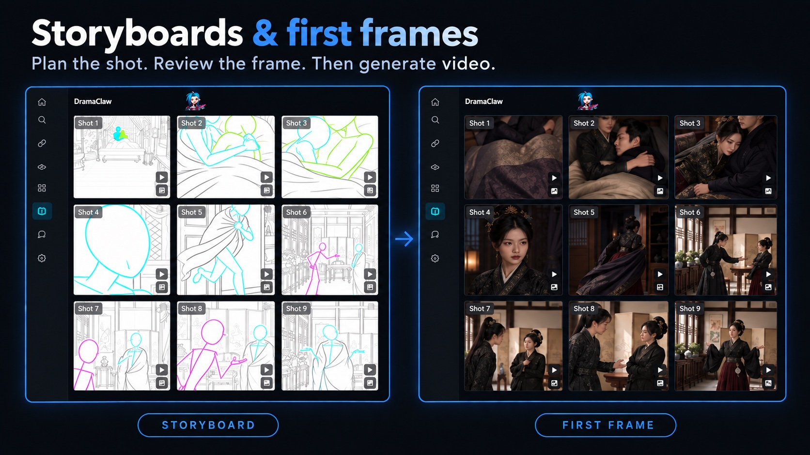
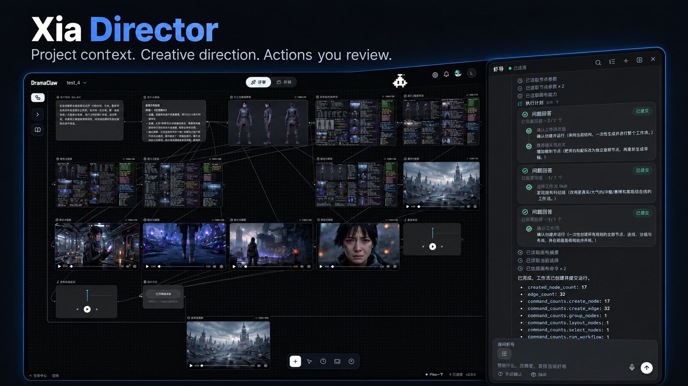

<div align="center">

<!-- TBD: ganti dengan logo resmi assets/logo.svg -->
<h1>DramaClaw</h1>

## Make Your Own DC.

<p align="left">

Mereka bilang Anda sudah usang.<br/>
Mungkin justru gagasan "bekerja untuk orang lain"-lah yang sudah usang.<br/>
<br/>
Di era AI, pertanyaan sebenarnya bukan apakah mesin menggantikan manusia.<br/>
Pertanyaan sebenarnya adalah:<br/>
Siapa yang memiliki mesin-mesin itu?<br/>
Siapa yang memiliki pipeline-nya?<br/>
Siapa yang memiliki produktivitas yang sudah diindustrialisasi?<br/>
<br/>
Jika jawabannya selalu Big Tech,<br/>
maka AI bukan pemberdayaan.<br/>
Itu hanyalah tembok baru.<br/>
<br/>
Saya Eric.<br/>
<br/>
Ini bukan demo.<br/>
Bukan mainan.<br/>
Bukan edisi yang dipangkas.<br/>
<br/>
Ini adalah jalur produksi drama yang sudah diindustrialisasi — yang tim kami sendiri jalankan setiap hari.<br/>
Dari naskah ke storyboard, dari aset ke film jadi — seluruh rantai.<br/>
<br/>
Karena manusia bukan hewan beban.<br/>
Karena kreativitas adalah garis pertahanan terakhir umat manusia.<br/>
<br/>
Yang ingin dilakukan DramaClaw sangat sederhana:<br/>
<br/>
<strong>Robohkan tembok itu.</strong><br/>
<br/>
Masukkan kekuatan produksi drama terindustrialisasi yang dulu hanya dimiliki Big Tech<br/>
ke tangan kreator biasa.<br/>
<br/>
Kodenya ada di sini.<br/>
Jika ini beresonansi, tinggalkan sebuah ⭐.<br/>
Kami akan terus merobohkan tembok.

</p>

<p align="left">

<strong>Dan ya, Anda bisa menghasilkan uang darinya.</strong><br/>
DramaClaw memakai <a href="../LICENSES/Elastic-2.0.txt">Elastic License 2.0</a>. Jalankan, ubah, jual apa yang Anda bangun dengannya —<br/>
versi mandiri bebas untuk penggunaan komersial, tanpa perlu izin.<br/>
Kami hanya meminta satu hal: tulisan kecil "Powered by DramaClaw" di sudut UI Anda.<br/>
Satu-satunya pintu yang masih tertutup adalah membungkusnya sebagai SaaS terhosting untuk orang lain; lisensi itu belum dibuka.<br/>
Mengapa, dan FAQ-nya: <a href="https://github.com/dramaclaw/dramaclaw/issues/475">#475</a>.

</p>

<br/>

[](../LICENSES/Elastic-2.0.txt)
[](https://github.com/dramaclaw/dramaclaw/stargazers)
[](https://github.com/dramaclaw/dramaclaw/releases)
[](#quick-start)

[English](../README.md) &nbsp;|&nbsp; [简体中文](./README_zh.md) &nbsp;|&nbsp; [Tiếng Việt](./README_vi.md) &nbsp;|&nbsp; [ไทย](./README_th.md) &nbsp;|&nbsp; **Bahasa Indonesia** &nbsp;|&nbsp; [Website](https://dramaclaw.ai) &nbsp;|&nbsp; [Dokumentasi](../docs/id/README.md) &nbsp;|&nbsp; [Mulai Cepat](../docs/id/getting-started/quickstart.md)

</div>

<br/>

<p align="center">
  
</p>

<!--
  Video demo — setelah mengunggah, tempel tautan user-attachments di baris sendiri di bawah.
  Cara mengunggah: buka Issue baru di github.com (jangan kirim), seret video demo
  ke badan Issue, tunggu hingga selesai diunggah dan otomatis menghasilkan tautan
  https://github.com/user-attachments/assets/...mp4, salin ke sini, lalu
  buang Issue tersebut. GitHub merender URL di baris sendiri sebagai pemutar inline.

  https://github.com/user-attachments/assets/REPLACE-AFTER-UPLOAD
-->

<p align="center">
  <sub>🎬 Trailer: <a href="https://www.bilibili.com/video/BV1iQV26cE4S">Bilibili</a> &nbsp;·&nbsp; <a href="https://www.youtube.com/watch?v=64apa3maxK0">YouTube</a></sub>
</p>

<br/>

<div align="center">

## 🎬 Made with DramaClaw

<sub>Drama pendek sungguhan yang diproduksi tim kami di pipeline ini &mdash; klik tautan untuk memutar.</sub>

<table>
  <tr>
    <td align="center" width="205" valign="top">
      <br/>
      <b>归灵司</b><br/>
      <a href="https://nfg-web-assets.cdnfg.com/dramaclaw/guilingsi/guilingsi-ep01.mp4">▶ Ep. 1</a>
    </td>
    <td align="center" width="205" valign="top">
      <br/>
      <b>鲁班</b><br/>
      <a href="https://nfg-web-assets.cdnfg.com/dramaclaw/luban/luban-ep01.mp4">▶ Ep. 1</a>
    </td>
    <td align="center" width="205" valign="top">
      <br/>
      <b>师兄你怎么不舔了</b><br/>
      <a href="https://nfg-web-assets.cdnfg.com/dramaclaw/shixiong-butianle/shixiong-butianle-ep01.mp4">▶ Ep. 1</a>
    </td>
  </tr>
  <tr>
    <td align="center" width="205" valign="top">
      <br/>
      <b>天命不可欺</b><br/>
      <a href="https://nfg-web-assets.cdnfg.com/dramaclaw/tianmingbukeqi/tianmingbukeqi-ep02.mp4">▶ Ep. 02</a> &nbsp;·&nbsp; <a href="https://nfg-web-assets.cdnfg.com/dramaclaw/tianmingbukeqi/tianmingbukeqi-ep58.mp4">Ep. 58</a>
    </td>
    <td align="center" width="205" valign="top">
      <br/>
      <b>乌龙仙途</b><br/>
      <a href="https://nfg-web-assets.cdnfg.com/dramaclaw/wulongxiantu/wulongxiantu-ep01.mp4">▶ Ep. 1</a>
    </td>
    <td align="center" width="205" valign="top">
      <br/>
      <b>非遗㑇舞</b><br/>
      <a href="https://nfg-web-assets.cdnfg.com/dramaclaw/feiyi-zhouwu/feiyi-zhouwu.mp4">▶ Putar</a>
    </td>
  </tr>
</table>

<sub>Klip lainnya:
<a href="https://nfg-web-assets.cdnfg.com/dramaclaw/3d-anime-montage-demo/3d-anime-montage-demo.mp4">3D 动漫混剪 demo</a> &nbsp;·&nbsp;
<a href="https://nfg-web-assets.cdnfg.com/dramaclaw/dongtai-dadou/dongtai-dadou.mp4">动态打斗</a></sub>

</div>

<br/>

## Apa itu DramaClaw?

DramaClaw adalah **jalur produksi drama AI yang source-available** — dan semakin banyak juga untuk kisah visual apa pun yang ingin Anda ceritakan dengan model generatif. Ia punya dua wajah yang berbagi satu pustaka aset dan satu agent:

- **XiaHua — kanvas tak terbatas.** Workbench berbasis node di mana Anda menghasilkan, mengedit, dan menghubungkan gambar, video, audio, set 3D, dan naskah secara bebas, lalu mempromosikan yang Anda sukai kembali ke series. Di sinilah sebagian besar kerja kreatif kami sendiri terjadi hari ini, dan ke arah mana DramaClaw bergerak.
- **Series (XiaJi) — pipeline.** Masukkan naskah atau skenario, dan DramaClaw mengambil pekerjaan berat: menyusun struktur cerita, merencanakan episode, menulis skrip, menggambar storyboard dan frame pertama, mensintesis voice-over, dan memotong film jadi.

**Xia Director**, agent bawaan, berdiri di atas keduanya: menjawab pertanyaan tentang proyek Anda, menjalankan tugas pipeline, dan dapat membangun serta menjalankan graf node di kanvas untuk Anda.

Dibangun untuk kreator, studio indie, dan engineer kreatif — jalankan seluruh "pabrik drama" di mesin Anda sendiri, tanpa menyambung-nyambungkan puluhan alat yang terpisah atau menyerahkan materi Anda ke layanan cloud kotak hitam yang buram. Meskipun dibangun di sekitar drama, kanvas dan pipeline yang sama juga membawa ke iklan pendek, video produk e-commerce, dan format visual lainnya.

<br/>

## Kapabilitas Inti

### XiaHua — kanvas tak terbatas

<p align="center">
  
</p>
<p align="center"><sub>Satu prompt ke Xia Director (kanan) menjadi alur kerja 17 node, 32 edge ini di kanvas (kiri): brief → arah cerita → referensi karakter dan set → lima frame pertama shot → lima video shot → voice-over dan skor → cut final.</sub></p>

- **18 tipe node di satu kanvas** &mdash; upload, generasi / edit gambar, generasi storyboard, skrip, konteks beat, video, compose video, video story, audio, style, skill, group, anotasi teks, viewer panorama 360°, dunia 3D, export, dan lainnya. Hubungkan secara bebas; setiap node menyimpan riwayat generasinya sendiri.
- **Alat gambar** &mdash; generate, edit, redraw, outpaint, relight, upscale, multi-view, edit template, reverse-prompt, deteksi mark; sebuah **dinding style dengan 45 look drama pendek** untuk image-to-image
- **Alat video** &mdash; text / image / keyframe ke video, generasi omni-reference dengan **referensi file, tautan web, dan di kanvas**, edit video, erase, upscale, pemisahan audio, template kamera, analisis shot; Seedance 2.5 ada di katalog yang direkomendasikan
- **Audio** &mdash; sintesis suara dengan pustaka suara, suara referensi, generasi musik
- **Skill kanvas** &mdash; skill satu klik seperti sketch-from-context, frame-from-context, set-background, scene-360, review frame, dan perencanaan beat-graph
- **Dibangun untuk kanvas besar** &mdash; tab kanvas, outline elemen, minimap dan bookmark viewport, snap-align, rendering level-of-detail, multi-select dan group node, pintasan keyboard, riwayat revisi dengan restore, penguncian per kanvas
- **Commit ke series** &mdash; pratinjau dampaknya, lalu promosikan satu node atau seluruh batch ke pustaka aset atau sebuah episode; proyeksikan series kembali ke kanvas dari preset
- **Director World — set yang konsisten secara spasial** &mdash; gambar → set 3D Gaussian Splat dan panorama scene-360 sebagai node kanvas: set virtual yang bisa di-frame, mengunci struktur spasial, blocking karakter, dan penempatan kamera, sehingga lokasi yang sama tetap konsisten antar shot; frame shot di viewer 3D, tangkap, dan gunakan sebagai latar untuk generasi berikutnya

#### Director World

<p align="center">
  
</p>
<p align="center"><sub>Ilustrasi fitur berbasis screenshot; detail antarmuka mungkin berbeda dari rilis saat ini.</sub></p>

### Series (XiaJi) — pipeline

<p align="center">
  
</p>

Setiap langkah punya antarmuka sendiri — jalankan berurutan, lewati langkah, lanjut dari checkpoint mana pun, atau bahkan sambungkan orchestrator Anda sendiri.

- **Ingest terstruktur** &mdash; proyek baru membangun episode, karakter, dan scene langsung dari naskah atau skenario (Fountain didukung), tanpa knowledge graph atau embedding; jalur story-graph Cognee tetap ada untuk proyek lama
- **Pustaka aset & konsistensi identitas** &mdash; karakter, scene, props, dan suara disusun menurut tujuan dan folder; identitas stabil lintas episode, potret karakter, dan varian per episode
- **Perencanaan episode & generasi skrip** &mdash; segmentasi chapter, perencanaan beat, arc multi-episode; mode skrip adaptive / literal / staged dengan loop review-and-repair
- **Storyboard & frame pertama** &mdash; generasi bergaya yang digerakkan beat, pemisahan grid, pemilihan image-pool
- **Voice-over, komposisi video & export** &mdash; suara yang sadar emosi, perakitan episode, export video + subtitle dan paket aset lengkap
- **Visual Style** &mdash; unggah gambar referensi untuk mengekstrak parameter style dan menerapkannya ke seluruh proyek
- **Task Center** &mdash; status, progres, log, batalkan / coba lagi, lanjut-dari-checkpoint untuk job panjang; prasyarat divalidasi sebelum job diantrekan

#### XiaTang — pustaka aset

<p align="center">
  
</p>
<p align="center"><sub>Ilustrasi fitur berbasis screenshot; detail antarmuka mungkin berbeda dari rilis saat ini.</sub></p>

#### Storyboard & frame pertama

<p align="center">
  
</p>
<p align="center"><sub>Ilustrasi fitur berbasis screenshot; detail antarmuka mungkin berbeda dari rilis saat ini.</sub></p>

### Xia Director — agent

<p align="center">
  
</p>
<p align="center"><sub>Ilustrasi fitur berbasis screenshot; detail antarmuka mungkin berbeda dari rilis saat ini.</sub></p>

**Hari ini**

- **Mengenal proyek Anda** &mdash; memeriksa progres, memajukan tugas skrip / shot, mengaudit kelengkapan deliverable, dan menyarankan langkah berikutnya
- **Terbuka untuk agent lain** &mdash; MCP server lokal mengekspos DramaClaw ke Claude Code, Codex, dan klien MCP mana pun (hanya loopback, flag trust eksplisit); lihat [MCP untuk Claude Code](../docs/en/guides/mcp-claude-code.md)

**Berikutnya**

- **Bekerja di kanvas** &mdash; screenshot di atas adalah arahnya: deskripsikan filmnya, dan Xia Director membuat serta menghubungkan node, menatanya, menjalankannya, dan mereview hasilnya, dengan setiap perintah kanvas disetujui di browser Anda terlebih dahulu. Kanvas + agent adalah inti DramaClaw ke depan; lihat [Dalam Pengembangan](#in-development).

<br/>

## Mengapa DramaClaw?

**Kanvas yang memahami drama, dan agent yang bekerja di atasnya.** Kanvas node generik bisa menyambungkan apa saja tetapi tidak tahu apa-apa tentang episode, karakter, atau shot; alat series tahu kerajinannya tetapi mengunci Anda ke wizard. XiaHua memberi Anda kanvas bebas dengan node dan skill yang sadar drama, dan Xia Director sedang dibangun untuk menata, menjalankan, dan mereview graf-graf itu untuk Anda. Kombinasi itu adalah arah DramaClaw.

**Dibangun untuk novel-ke-drama-pendek.** Alat workflow umum bisa menyambungkan node, tetapi mereka tidak tahu apa itu "beat episode", tidak paham mengapa konsistensi identitas karakter lintas scene penting, dan tidak akan menjaga arc emosional sebuah chapter di sepanjang gambar + suara + editing. DramaClaw menanamkan semua penilaian itu ke dalam alatnya.

**Kanvas dan pipeline, bukan kanvas atau pipeline.** Kebanyakan alat memberi Anda salah satu: kanvas node bebas atau wizard kaku. DramaClaw menjalankan keduanya sebagai jalur ganda di atas satu pustaka aset: eksplorasi di kanvas, commit yang berhasil ke series, proyeksikan series kembali ke kanvas. Agent bekerja di keduanya.

**Setiap langkah dapat diuraikan.** Setiap tahap adalah tugas async independen dengan antarmuka sendiri. Jalankan berurutan, lewati langkah, lanjut di tengah jalan — toolchain-nya sendirilah produknya, tanpa kotak hitam tersembunyi.

**Bisa di-self-host, netral terhadap model.** Naskah Anda, karakter Anda, model Anda, server Anda. Pakai model frontier closed-source saat Anda ingin hasil terbaik; beralih ke model open-weight saat Anda ingin kontrol penuh. DramaClaw tidak akan mengunci Anda ke satu vendor saja.

### Perbandingan DramaClaw

Keunggulan bukan "lebih banyak generasi" — melainkan mengorganisasi seluruh loop produksi drama pendek (skrip → aset → shot → kanvas → cut final) menjadi sesuatu yang reusable, kolaboratif, dan scalable.

<sub>Legenda: ✅ Penuh · ◐ Parsial · ○ Direncanakan · ❌ Tidak ada — nama kompetitor sebagian disamarkan; perbandingan berdasarkan dokumentasi produk dan positioning yang tersedia secara publik.</sub>

| Kapabilitas | L\*TV | R\*Hub | T\*Now | S\*ko | U\*dream | O\*II | J\*/K\* | **DramaClaw** |
|---|:--:|:--:|:--:|:--:|:--:|:--:|:--:|:--:|
| Pratinjau storyboard (skrip→shot, board) | ◐ | ✅ | ◐ | ✅ | ◐ | ❌ | ❌ | ✅ |
| Series interaktif (multi-episode, branching, IP) | ◐ | ◐ | ◐ | ✅ | ◐ | ❌ | ❌ | ✅ |
| Pustaka aset (karakter/scene/props/suara) | ◐ | ❌ | ◐ | ✅ | ◐ | ○ | ❌ | ✅ |
| Konsistensi scene (varian, 360°, multi-state) | ✅ | ◐ | ❌ | ❌ | ○ | ❌ | ❌ | ✅ |
| Dunia sutradara (set 360°/3D, kamera, framing) | ✅ | ◐ | ❌ | ❌ | ◐ | ❌ | ❌ | ✅ |
| Deliveri final (multi-shot, subtitle/SRT, pack) | ✅ | ○ | ○ | ✅ | ✅ | ❌ | ❌ | ✅ |
| Produksi tim (sharing, peran, tugas, biaya) | ✅ | ✅ | ○ | ✅ | ○ | ○ | ○ | ✅ |
| Kanvas tak terbatas (berbasis node, eksplorasi bebas) | ✅ | ✅ | ✅ | ❌ | ✅ | ✅ | ✅ | ✅ |
| Dual-track (pipeline utama + eksplorasi kanvas) | ❌ | ❌ | ❌ | ❌ | ❌ | ❌ | ❌ | ✅ |
| Style kustom (template, prompt, negative) | ✅ | ◐ | ○ | ✅ | ◐ | ○ | ◐ | ✅ |
| Agent bawaan (asisten, skill, saran) | ✅ | ✅ | ✅ | ○ | ✅ | ○ | ✅ | ✅ |
| Pendamping kreatif (persona, nudge, feedback) | ❌ | ❌ | ❌ | ❌ | ❌ | ❌ | ❌ | ✅ |
| Source-available (self-host, fork, kustomisasi) | ❌ | ❌ | ❌ | ❌ | ❌ | ❌ | ❌ | ✅ |

<br/>

## Persyaratan Sistem

DramaClaw menjalankan semua inferensi melalui **gateway yang kompatibel dengan OpenAI** — baik layanan resmi RelayClaw maupun [dramaclaw-gateway](https://github.com/dramaclaw/dramaclaw-gateway) yang dibundel, yang merutekan ke provider yang Anda konfigurasi. Tidak ada model yang berjalan di mesin Anda, jadi jejak lokalnya ringan. Laptop biasa atau VPS kecil sudah cukup.

| Item | Persyaratan |
|---|---|
| **CPU / RAM** | ≥ 2 vCPU / 4 GB direkomendasikan (tidak termasuk inferensi model — itu berjalan di gateway) |
| **GPU** | Tidak diperlukan untuk pipeline standar. Hanya ekstra opsional `world` (voxel / panorama-ke-3D) yang membutuhkan GPU + image CUDA |
| **Disk** | Beberapa GB untuk image plus media/state yang dihasilkan di bawah volume `ce-data` (tanpa minimum keras) |
| **OS** | macOS (Apple Silicon / Intel), Windows (Docker Desktop + backend WSL2), Linux (Docker Engine + plugin compose) |
| **Docker** | Docker + `docker compose` |
| **Port** | `8080` UI web · `8780` REST API · `3000` UI admin gateway terbundel (hanya host secara default, bisa diperluas) |
| **Datastore** | Tidak diperlukan — tanpa Postgres, Redis, Celery, atau Ray. Tugas berjalan in-process; state berada di filesystem lokal (SQLite + file) |
| **Jaringan** | Akses keluar ke gateway resmi `relayclaw.cdnfg.com`, dan/atau ke provider model yang Anda konfigurasi di gateway terbundel |

> Pengembangan lokal (non-Docker) juga membutuhkan Python 3.11–3.12 + [`uv`](https://docs.astral.sh/uv/) + `ffmpeg`. Prasyarat lengkap di [panduan Self-hosting](../docs/en/guides/self-hosting.md).

<br/>

## <a name="quick-start"></a>Mulai Cepat

### Docker (direkomendasikan)

Setiap GitHub Release menerbitkan image multi-arch (amd64/arm64) ke Docker Hub.

**Build dari sumber (default)** — clone DramaClaw dan [dramaclaw-gateway](https://github.com/dramaclaw/dramaclaw-gateway) terbundel berdampingan; `docker compose up -d --build` membangun ketiga layanan dari kedua checkout itu.

```bash
git clone https://github.com/dramaclaw/dramaclaw.git
git clone https://github.com/dramaclaw/dramaclaw-gateway.git   # bundled gateway, built from ../dramaclaw-gateway
cd dramaclaw

cp .env.example .env
# Edit .env — set PROMPT_EXPORT_PASSWORD to a non-default value.

docker compose up -d --build   # builds and starts three services: api / newapi (bundled gateway) / web
```

Kedua checkout adalah repo git biasa: edit, `git pull`, rebuild. Hanya kode DramaClaw yang berubah? `docker compose up -d --build api web`. Hanya gateway? `docker compose up -d --build newapi`. Clone gateway di tempat lain, atau lebih suka Docker mengambilnya dari git? Setel `DRAMACLAW_GATEWAY_SRC` di `.env` ke path itu atau ke `https://github.com/dramaclaw/dramaclaw-gateway.git#main`.

**Tanpa build** — tarik image yang sudah diterbitkan (tidak perlu clone gateway):

```bash
docker compose -f docker-compose.release.yml up -d
```

Buka aplikasi di <http://localhost:8080>; REST API di <http://localhost:8780>. Di **Settings → Model Config** pilih salah satu:

- **Official** — tempel DC key Anda (dapatkan di <https://relayclaw.cdnfg.com>); tidak perlu mapping model. Gateway terbundel tetap idle.
- **Custom** — satu klik menginisialisasi gateway `newapi` terbundel; lalu tambahkan channel upstream Anda sendiri.
- **Local + Official Hybrid** — official untuk pipeline utama, gateway terbundel untuk channel tambahan.

Langkah lengkap di [Mulai Cepat](../docs/id/getting-started/quickstart.md).

Pin versi atau ganti registry di `.env` (`DRAMACLAW_VERSION`, `DRAMACLAW_GATEWAY_VERSION`, `DRAMACLAW_IMAGE_PREFIX`) — ini hanya berlaku untuk mode image (`docker-compose.release.yml`). China daratan: setel `DRAMACLAW_IMAGE_PREFIX=claymore-registry.cn-chengdu.cr.aliyuncs.com/dramaclaw` dan pin kedua versi (mirror ACR hanya membawa tag yang di-pin).

> Migrasi dari checkout lama? Untuk build sumber, pertama `git clone https://github.com/dramaclaw/dramaclaw-gateway.git ../dramaclaw-gateway` (gateway kini dibangun dari checkout sibling itu; tanpa itu build berhenti dengan `unable to prepare context`). `docker-compose.selfhosted.yml` / `docker-compose.selfhosted.release.yml` telah dihapus — gunakan `docker-compose.yml` (build sumber) / `docker-compose.release.yml` (image). Nama layanan dan volume `ce-data` / `newapi-data` tidak berubah; data yang ada dipakai ulang apa adanya. Port gateway terbundel kini default hanya bind ke `127.0.0.1`; setel `ST_NEWAPI_BIND=0.0.0.0` di `.env` jika Anda butuh akses remote ke sana.

### Pengembangan lokal (uv + Python 3.11+)

```bash
git clone https://github.com/dramaclaw/dramaclaw.git
cd dramaclaw

uv sync
cp .env.example .env && $EDITOR .env

uv run novelvideo api --port 8780   # start the REST API (CE defaults to inline tasks, no Ray/Redis)
```

Frontend di terminal kedua: `cd frontend && pnpm install && pnpm dev`.

**Gateway.** Di mode **Official** Anda tidak butuh apa pun lagi. Untuk **Custom** atau **Local + Official Hybrid** API mengharapkan gateway di `127.0.0.1:3000` yang file SQLite-nya adalah `./state/newapi/one-api.db` (itulah yang ditulis "Initialize" di Settings; `NEWAPI_ADMIN_BASE_URL` di `.env` sudah mengarah ke sana). Jalankan image yang diterbitkan dengan direktori itu di-mount:

```bash
mkdir -p state/newapi
docker run -d --name dramaclaw-gateway -p 127.0.0.1:3000:3000 \
  -v "$PWD/state/newapi:/data" \
  claymorelab/dramaclaw-gateway:v1.0.0-rc.24-dramaclaw.1
```

atau jalankan gateway dari sumber di checkout sibling (`make dev-api` / `make dev-web` di [dramaclaw-gateway](https://github.com/dramaclaw/dramaclaw-gateway#develop), atau `go build` dan start binary dengan `SQLITE_PATH=<path to>/dramaclaw/state/newapi/one-api.db`).

<br/>

## Model & Provider yang Didukung

DramaClaw tetap netral terhadap model — semua model text / image / video / audio terhubung melalui **gateway yang kompatibel dengan OpenAI**. Pilih mode di **Settings → Model Config**:

- **Official (direkomendasikan)** — tempel DC key Anda (dapatkan di <https://relayclaw.cdnfg.com>), simpan, selesai. RelayClaw sudah mengirim setiap mapping model yang dibutuhkan DramaClaw; tidak ada yang perlu dikonfigurasi.
- **Custom** — satu klik menginisialisasi `dramaclaw-gateway` terbundel, lalu tambahkan channel provider Anda sendiri (API key, model ID) di UI admin-nya. Setiap model yang dipanggil DramaClaw lewat channel Anda.
- **Local + Official Hybrid** — pertahankan model official untuk pipeline utama dan tambahkan channel ekstra (misalnya workflow video ComfyUI lokal) melalui gateway terbundel.

Panduan lengkap di [Mengonfigurasi Model](../docs/id/getting-started/configuring-models.md).

### Gateway terbundel: dramaclaw-gateway

Layanan `newapi` di `docker-compose.yml` adalah [**dramaclaw-gateway**](https://github.com/dramaclaw/dramaclaw-gateway), fork DramaClaw sendiri dari [New API](https://github.com/QuantumNous/new-api). Ia berbicara kontrak **DC-Media** yang dipakai DramaClaw untuk image / video / audio (peran media, referensi, frame pertama / terakhir) dan mengubah setiap request menjadi API native provider. Image: [`claymorelab/dramaclaw-gateway`](https://hub.docker.com/r/claymorelab/dramaclaw-gateway) di Docker Hub, di-pin oleh `DRAMACLAW_GATEWAY_VERSION` di `.env`. Ia tetap idle di mode Official dan hanya dipakai setelah Anda beralih ke **Custom** atau **Local + Official Hybrid**.

Adapter provider yang sudah dikirim di gateway hari ini (lihat [matriks dukungan channel](https://github.com/dramaclaw/dramaclaw-gateway/blob/main/docs/providers/en/README.md) untuk status verifikasi): ComfyUI · MiniMax / Hailuo · VolcEngine Doubao / Seedance · fal.ai · Alibaba · Kling · Jimeng · Vertex AI · Gemini · OpenAI / Sora · Suno. Ingin provider lain? Gateway punya [scaffold generator dan panduan kontribusi](https://github.com/dramaclaw/dramaclaw-gateway/blob/main/CONTRIBUTING.md).

| Tahap                | Mode Official (RelayClaw)                          | Mode Custom / Hybrid (gateway terbundel)                    |
|----------------------|----------------------------------------------------|-----------------------------------------------------------|
| **Text / LLM**       | model `DC-*-LLM`, tanpa mapping yang dibutuhkan    | channel chat apa pun yang kompatibel OpenAI               |
| **Image**            | gpt-image · nano-banana                            | channel image apa pun yang terdaftar di gateway           |
| **Video**            | seri Seedance 1.0 / 1.5 / 2.0 · happyhorse         | adapter video DC-Media apa pun (Seedance, Hailuo, Kling, ComfyUI, …) |
| **Voice-over**       | IndexTTS2                                          | channel audio apa pun yang terdaftar di gateway           |
| **Story graph**      | Cognee (`DC-cognee-embedding`)                     | channel embedding apa pun                                 |
| **Task runtime**     | inline in-process (tanpa Ray / Redis / Celery)     | sama                                                      |
| **Storage**          | filesystem lokal                                   | sama                                                      |

<br/>

## <a name="in-development"></a>Dalam Pengembangan

Fitur-fitur ini sedang dibangun secara terbuka dan belum ada di rilis mana pun. Pantau branch-nya, atau datang membantu.

- **Xia Director di kanvas** &mdash; agent membuat dan menghubungkan node, memperbarui data node, menata dan mengelompokkan node, menjalankan aksi node, dan membangun seluruh graf workflow, dengan setiap perintah kanvas disetujui di browser terbuka terlebih dahulu.
- **Katalog workflow dan skill komunitas** &mdash; katalog 11 skill workflow dan 60 resep (drama pendek, iklan e-commerce, iklan karakter IP, kampanye sosial, style anime / Pixar / LEGO / kung-fu…) yang menata seluruh graf generasi; skill dan resep sebagai bundle yang bisa diinstal, diekspor, dan dibagikan
- **agent-kit** &mdash; paket portabel yang membawa workflow DramaClaw yang sama ke Hermes, OpenClaw, WorkBuddy, Claude Code, dan Codex
- **Panggung previz** &mdash; panggung blocking 3D di browser sebagai node kanvas: timeline multi-track, rig dan path karakter, model kamera lensa / sensor nyata, tracking close-up, lalu tangkap shot yang sudah di-frame langsung ke node berikutnya. Branch: `feat/previz-canvas-node`
- **Cerita interaktif** &mdash; titik pilihan bercabang di kanvas, dikompilasi ke cerita ink dan diekspor sebagai pemutar HTML mandiri, dengan statistik playtest dan cakupan path. Branch: `feat/canvas-fmv`
- **Iklan interaktif** &mdash; skill dan resep iklan di atas, digabung dengan playback bercabang, untuk video produk yang bisa dikemudikan penonton

<br/>

## <a name="documentation"></a>Dokumentasi

- [**Manual pengguna produk**](https://neo-flying.feishu.cn/docx/JGNTdsjJuo748TxJkxecoYs2nth) — walkthrough UI lengkap (Feishu)
- [Ikhtisar fitur](../docs/en/concepts/features.md)
- [Arsitektur](../docs/en/concepts/architecture.md)
- [Mulai Cepat](../docs/id/getting-started/quickstart.md)
- [Panduan self-hosting](../docs/en/guides/self-hosting.md)
- [Mengonfigurasi penyedia model](../docs/id/getting-started/configuring-models.md)
- [Dokumentasi lainnya &rarr;](../docs/id/README.md)

<br/>

## Bergabung dengan Komunitas / Berkontribusi

- [Laporkan Bug](https://github.com/dramaclaw/dramaclaw/issues/new?template=bug_report.yml)
- [Ajukan Fitur](https://github.com/dramaclaw/dramaclaw/issues/new?template=feature_request.yml)
- [Ikuti Diskusi](https://github.com/dramaclaw/dramaclaw/discussions)
- [Panduan Kontribusi](../CONTRIBUTING.md)
- [Kebijakan Keamanan](../SECURITY.md)

Kami terus mengkurasi dan memberi label [`good first issue`](https://github.com/dramaclaw/dramaclaw/labels/good%20first%20issue) — tempat yang bagus untuk memulai.

<br/>

## Kontributor

Orang-orang yang membangun DramaClaw — terima kasih. 💜

<table>
  <tr>
    <td align="center"><a href="https://github.com/bopy-zou"><br/><sub>bopy-zou</sub></a></td>
    <td align="center"><a href="https://github.com/Handanhhhy"><br/><sub>Handanhhhy</sub></a></td>
    <td align="center"><a href="https://github.com/Hanlin-Gabriel"><br/><sub>Hanlin-Gabriel</sub></a></td>
    <td align="center"><a href="https://github.com/ryanhuang-duat"><br/><sub>ryanhuang-duat</sub></a></td>
    <td align="center"><a href="https://github.com/lywaterman"><br/><sub>lywaterman</sub></a></td>
    <td align="center"><a href="https://github.com/n7s4"><br/><sub>n7s4</sub></a></td>
  </tr>
  <tr>
    <td align="center"><a href="https://github.com/NewYuee"><br/><sub>NewYuee</sub></a></td>
    <td align="center"><a href="https://github.com/SimonRen"><br/><sub>SimonRen</sub></a></td>
    <td align="center"><a href="https://github.com/vkiki"><br/><sub>vkiki</sub></a></td>
    <td align="center"><a href="https://github.com/wangwenqq"><br/><sub>wangwenqq</sub></a></td>
    <td align="center"><a href="https://github.com/zhen2025109"><br/><sub>zhen2025109</sub></a></td>
    <td align="center"><a href="https://github.com/revolutionarybukhari"><br/><sub>revolutionarybukhari</sub></a></td>
  </tr>
  <tr>
    <td align="center"><a href="https://github.com/yhay81"><br/><sub>yhay81</sub></a></td>
    <td align="center"><a href="https://github.com/hoanglongggggggggg"><br/><sub>hoanglongggggggggg</sub></a></td>
  </tr>
</table>

<br/>

## Diproduksi Oleh

<p align="center">
  <picture>
    <source media="(prefers-color-scheme: dark)" srcset="../assets/partners/neoflying-lab-dark.png">
    
  </picture>
</p>

<p align="center"><sub>Logo adalah merek dagang pemiliknya masing-masing, ditampilkan dengan izin.</sub></p>

<br/>

## Lisensi

[Elastic License 2.0](../LICENSES/Elastic-2.0.txt). Bebas digunakan, diubah, didistribusikan ulang, dan menjual apa yang Anda bangun dengannya; simpan tulisan kecil "Powered by DramaClaw" di UI Anda. Satu-satunya batasan adalah Anda tidak boleh menawarkan perangkat lunaknya sendiri sebagai layanan terhosting untuk orang lain. Lihat [penjelasan lisensi](../docs/en/license.md) dan [pernyataan lisensi](https://github.com/dramaclaw/dramaclaw/issues/475).

<br/>

## Riwayat Star

<a href="https://www.star-history.com/?repos=dramaclaw%2Fdramaclaw&type=date&legend=top-left">
 <picture>
   <source media="(prefers-color-scheme: dark)" srcset="https://api.star-history.com/chart?repos=dramaclaw/dramaclaw&type=date&theme=dark&legend=top-left&sealed_token=CWTXgm9EqgQmnSFWk0inuf_iZSml5r1nclyIsUyisWgYhUzFVJdI8G61vyFACIQe14weeMtjWSxpkzWdtFqyb93uV4uaRElaXWQv2kFxFFyL8KbUQBCOBUWXDtZc81J8YlaSiBVVXeOygLYZliOK4VQo4i1Ioqkxn5js-Bq0gbqVOH_wF3GCQ_EnMGLy" />
   <source media="(prefers-color-scheme: light)" srcset="https://api.star-history.com/chart?repos=dramaclaw/dramaclaw&type=date&legend=top-left&sealed_token=CWTXgm9EqgQmnSFWk0inuf_iZSml5r1nclyIsUyisWgYhUzFVJdI8G61vyFACIQe14weeMtjWSxpkzWdtFqyb93uV4uaRElaXWQv2kFxFFyL8KbUQBCOBUWXDtZc81J8YlaSiBVVXeOygLYZliOK4VQo4i1Ioqkxn5js-Bq0gbqVOH_wF3GCQ_EnMGLy" />
   
 </picture>
</a>

<br/><br/>

<div align="center">
  <sub>Dibangun untuk para storyteller. Sumber, terbuka untuk semua.</sub>
</div>

## Notices

Lihat `NOTICE` untuk pemberitahuan branding wajib dan atribusi pihak ketiga.
